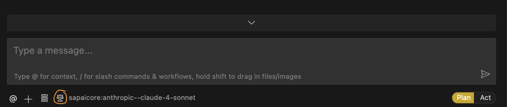

1. mkdir vish-portfolio
2. git clone https://github.com/VishalThimmaiah/vishalthimmaiah.com.git

# Tech

1. AI Agent
	Cline coding assistant (sonar,sonar-pro)
	https://docs.cline.bot/features/cline-rules
   

1. MCP Servers (Tools for the AI agent)
	- Context7 - documentation
	- sequential thinking
	- perplexity research

	- Browser tools (Optional)
	- Fetch

1. Framework
	NextJS

1. CSS
	UI Theme - Next UI or Shadcn/UI (built using Radix UI)

	Shadcn - Nextjs <-X-> no connection - Doesn't break when you update the nextjs

	NextUI - Update breaks it

	Animation - Acternity UI 

	Cline rules:
		1. Theme Compliance
1. Vercel 
	it is for hosting/deployment purpose. it can also provide option of storage(for files for application eg. hero image/vishal)

